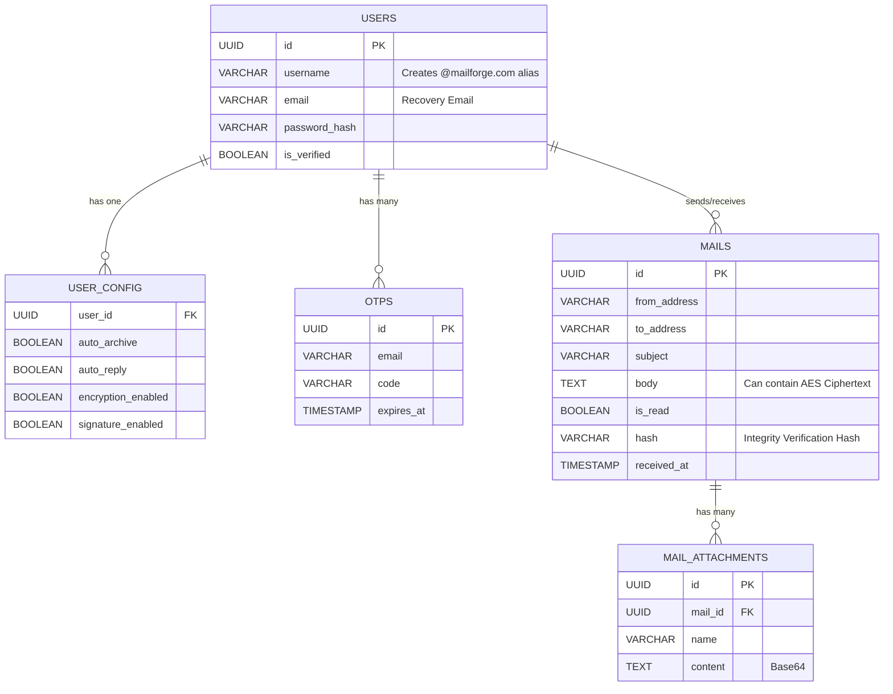

# MailForge


MailForge is a secure, end-to-end encrypted (E2EE) mail service modeled similarly to Gmail, but with cryptographic security built in as a first-class citizen. This project includes a modern React frontend with Tailwind CSS and a microservice-ready backend data schema powered by Supabase PostgreSQL.

## Architecture Overview

The system is designed with a **Microservices Architecture** mindset, integrating tightly with a centralized **Supabase PostgreSQL** database.

### Core Components

1. **Frontend (React + Vite + Tailwind)**
   - Manages the user interface, authentication flows, and real-time SSE subscriptions.
   - Responsible for **Client-Side Encryption (AES)**. Sensitive email bodies are encrypted using `crypto-js` before the payload is dispatched to the backend, ensuring zero-knowledge privacy for the backend services.

2. **Database (Supabase PostgreSQL)**
   - Acts as the central source of truth for the microservices.
   - Contains schemas for Users, User Configuration, Mails, Attachments, and OTP tracking.
   - Employs Row Level Security (RLS) to ensure data isolation.

3. **Backend Microservices (Spring Boot / Node - Designed For)**
   - **API Gateway (Port 8080)**: Routes traffic to respective services. Handles SSE connections `/sse/subscribe/{deviceId}`.
   - **Auth Service (Port 8081)**: Manages JWT generation and OTP validation.
   - **User Service (Port 8082)**: Manages user creation, profiles, and configurations.
   - **Mail Service (Port 8083)**: Manages sending emails, retrieving inboxes, and cryptographic hash verification.

### Database Schema (ERD)



## Security & Encryption Features

Security is the main feature of MailForge.

1. **Client-Side AES Encryption**
   - Users can toggle "End-to-End Encryption" when composing an email.
   - The email body is encrypted directly in the browser using AES (Advanced Encryption Standard) via `crypto-js` with a secret user-defined passphrase.
   - The backend API only receives the encrypted payload (marked with `-----BEGIN MAILFORGE ENCRYPTED MESSAGE-----`).
   - The recipient must enter the exact symmetric passphrase to decrypt the message locally in their browser.

2. **Integrity Checking**
   - The Mail Service stores a cryptographic `hash` of the email when it is received.
   - When viewing an email, the frontend automatically hits the `GET /mail/{id}/verify` endpoint to verify that the email data has not been tampered with. If verified, a green "Integrity Verified" badge is displayed.

3. **OTP Account Verification**
   - New accounts require external email OTP verification before they can log in, mitigating spam and bot account creation.

## Setup Instructions

### 1. Database Setup
A full schema and mock data script has been provided in the repository.
1. Navigate to your Supabase Dashboard: `https://hfmsjzbvsmigbdpkpshb.supabase.co`
2. Open the **SQL Editor**.
3. Copy the entire contents of the `supabase_setup.sql` file located in the root of this project.
4. Paste it into a new query and click **RUN**.
   - *This will instantly build all tables, setup basic RLS policies, and inject mock user data and emails into your database.*

### 2. Frontend Environment Variables
Ensure your `.env` file contains your Supabase credentials if your frontend or serverless functions need direct connection, though primary API routing is expected to go through the microservices.

```env
VITE_SUPABASE_URL=https://your-project-id.supabase.co
VITE_SUPABASE_PUBLISHABLE_KEY=your_supabase_publishable_key
```

### 3. Running the App
```bash
npm install
npm run dev
```

You can log in using the mock data generated by the SQL script:
- **Username**: `alice`
- **Password**: `password` (Note: Ensure your mock backend accepts this depending on the Auth service implementation)
